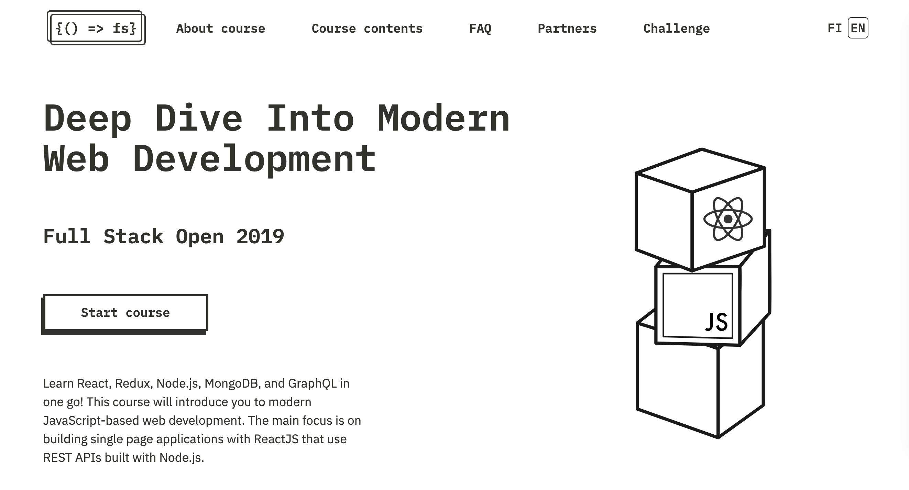

# FSO2019-3

SPA w/ ReactJS that use REST APIs built with Node.js (https://fullstackopen.com/en)

---

## Part 4: Testing Express servers, user administration

- a. Structure of backend application, introduction to testing
- b. Testing the backend
- c. User administration
- d. Token authentication