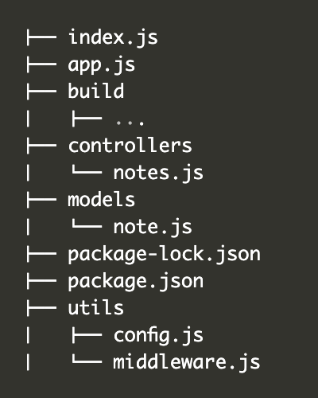

## Part 4 - [Testing Express servers, user administration](https://fullstackopen.com/en/part4)

---

### [a) Structure of backend application, introduction to testing](https://fullstackopen.com/en/part4/structure_of_backend_application_introduction_to_testing)

`Node.js Best Practice Project Structure`




#### index.js

Application을 start 하는 데에 쓰이는 파일로, 아래와 같이 간단하게 작성한다.

```js
const app = require('./app') // 실제 express App을 import 해온 뒤 어플을 시작한다.
const http = require('http')
const config = require('./utils/config')
const server = http.createServer(app)

server.listen(config.PORT, () => {
  console.log(`Server running on port ${config.PORT}`)
})
```


### app.js

```js
const config = require('./utils/config')
const express = require('express')
const bodyParser = require('body-parser')
const app = express()
const cors = require('cors')
const notesRouter = require('./controllers/notes')
const middleware = require('./utils/middleware')
const mongoose = require('mongoose')

console.log('connecting to', config.MONGODB_URI)

mongoose.connect(config.MONGODB_URI, { useNewUrlParser: true })
  .then(() => {
    console.log('connected to MongoDB')
  })
  .catch((error) => {
    console.log('error connection to MongoDB:', error.message)
  })

app.use(cors())
app.use(express.static('build'))
app.use(bodyParser.json())
app.use(middleware.requestLogger)

app.use('/api/notes', notesRouter)

app.use(middleware.unknownEndpoint)
app.use(middleware.errorHandler)

module.exports = app
```


#### /controllers/note.js

event handlers of routes 는 주로 controllers 라고 명명되므로 별개의 controllers 폴더에 저장한다.

```js
const notesRouter = require('express').Router() // 새로운 Router 객체 생성

//...

module.exports = notesRouter // Router 객체 export
```

Router 객체는 무엇일까? Express 매뉴얼에 따른 Router 객체의 정의는 아래와 같다.

>*A router object is an isolated instance of middleware and routes. You can think of it as a “mini-application,” capable only of performing middleware and routing functions. Every Express application has a built-in app router.*

Router은 middleware이다.
특정 모듈 안에서의 "상대적 경로" 를 정의하기 위해 사용될 수 있다.

일례로 기존에 index.js에서 아래와 같이 경로를 정의했다면

```js
app.delete('/api/notes/:id', (request, response) => {
```

note.js 컨트롤러에서는 notesRouter을 import 해와서 아래와 같이 사용하고

```js
notesRouter.delete('/:id', (request, response) => {
```

note controller을 가져오는 app.js 에서는 아래와 같이 작성해준다.

```js
const notesRouter = require('./controllers/notes')
app.use('/api/notes', notesRouter) // notesRouter은 api/notes 하위의 상대경로에서 작동하는 모든 경로들을 정의해 줄 수 있는 것
```


#### utils/config.js

dotenv 라이브러리를 통해 환경변수를 관리한다.

```js
require('dotenv').config()

let PORT = process.env.PORT
let MONGODB_URI = process.env.MONGODB_URI

module.exports = {
  MONGODB_URI,
  PORT
}
```

어플의 다른 파트에서 환경변수가 필요할 때는 아래와 같이 config 모듈을 import 하여 사용한다.

```js
const config = require('./utils/config')

console.log(`Server running on port ${config.PORT}`)
```


#### utils/middleware.js

Logger, errorHandler 등의 middleware도 한 곳에서 작성한 뒤 export 해서 사용한다.

```js
const requestLogger = (request, response, next) => {
  console.log('Method:', request.method)
  console.log('Path:  ', request.path)
  console.log('Body:  ', request.body)
  console.log('---')
  next()
}

const unknownEndpoint = (request, response) => {
  response.status(404).send({ error: 'unknown endpoint' })
}

const errorHandler = (error, request, response, next) => {
  console.error(error.message)

  if (error.name === 'CastError' && error.kind === 'ObjectId') {
    return response.status(400).send({ error: 'malformatted id' })
  } else if (error.name === 'ValidationError') {
    return response.status(400).json({ error: error.message })
  }

  next(error)
}

module.exports = {
  requestLogger,
  unknownEndpoint,
  errorHandler
}
```


### /models/note.js

기존에 mongoose와의 연결을 담당하던 부분을 app.js가 담당하게 되면서 models 폴더 안의 note.js는 오직 notes를 위한 noteSchema 만을 정의한다.

```js
const mongoose = require('mongoose')

const noteSchema = new mongoose.Schema({
  content: {
    type: String,
    required: true,
    minlength: 5
  },
  date: Date,
  important: Boolean,
})

noteSchema.set('toJSON', {
  transform: (document, returnedObject) => {
    returnedObject.id = returnedObject._id.toString()
    delete returnedObject._id
    delete returnedObject.__v
  }
})

module.exports = mongoose.model('Note', noteSchema)
```