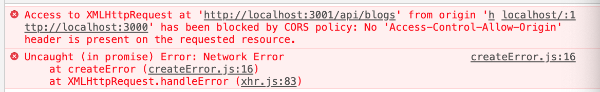
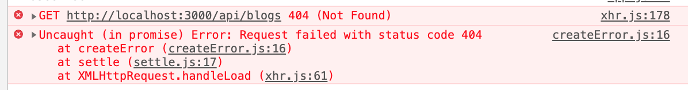
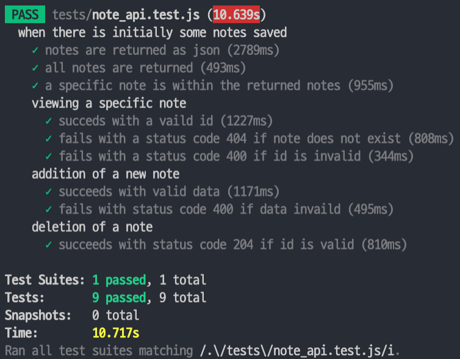

# [Exrcises] Part 4 - [Blog List Application](https://fullstackopen.com/en/part4)

---

Part4 의 Exercise인 Blog List 를 만드는 과정을 단계별로 기술하며 Part 3 Backend 내용을 전반적으로 복습한다.

## 0. Application 시작하기

- `npm init` 으로 Application의 template을 만든다.
- `npm install` 로 dependencies, devdependencies를 설치한다. [npm install에서 -S, -D flag의 역할](https://stackoverflow.com/questions/36022926/what-do-the-save-flags-do-with-npm-install)
-  `package.json` 의 script를 수정한다. (start, watch, test 등)
- `.gitignore` , `.env` 파일 등을 작성한다.

  

## 1. Express 도입하고 구조 정리하기

`index.js`

Application의 entry point인 index.js 에선 app을 import 해온 후 서버를 켠다.

```js
const app = require("./app"); // 실제 express App을 import 해온 뒤
const http = require("http"); 
const server = http.createServer(app); // 서버를 켠다.

server.listen(config.PORT, () => {
    console.log(`Server running on port ${config.PORT}`);
});
```

`app.js`

실제 Express Application 을 만들고, Controller, Middleware 등을 불러온다.

```js
const express = require("express");
const middleware = require("./utils/middleware");
const bodyParser = require("body-parser");
const notesRouter = require("./controllers/notes");

const app = express();

// 미들웨어는 순서가 중요하다
app.use(bodyParser.json());
app.use(middleware.requestLogger);

app.get("/", (req, res) => {
    res.send("<h1>Hello World!</h1>");
});
app.use("/api/notes", notesRouter);

app.use(middleware.unknownEndpoint);
app.use(middleware.errorHandler);

module.exports = app;
```

`controllers/blogs.js`

각 모듈별 상대경로 **라우터**들을 정의한다. 아래와 같이 특정 경로/메소드로 들어온 요청을 받아 핸들링하는 **event handler function** 을 정의한다.

```js
const notesRouter = require("express").Router();

let blogs = [{ writer: "hannah", content: "very first blog" }];

// '/' 경로의 요청을 핸들링하는 이벤트 핸들러
notesRouter.get("/", (request, response) => {
    res.json(blogs);
});

module.exports = notesRouter;
```

2개의 파라미터 request, response 는 아래와 같은 역할을 한다.

- request : contains all of the information of the HTTP request

- response : used to define how the request is responded to

  

## 2. 프론트엔드와 연결하기

### cors 해결하기

백엔드에서 정의한 경로대로 프론트엔드에서 요청을 보내면 아래와 같은 오류가 발생한다.



원인은 CORS 이슈! 
해결방법은 `cors` middleware을 사용하는 것. 

```bash
npm install cors --save
```

백엔드에서 이 cors middleware을 적용해서 allow for requests from all origins 하도록 한다.

```js
const cors = require('cors')
app.use(cors())
```

### frontend 를 빌드해 backend에 serve하고 이 과정을 자동화하기

Frontend를 배포하는 방법 중 하나는 Frontend 에서 `npm run build` 명령어를 통해 빌드된 production build ( = build directory) 를  Backend 의 root directory에 복사하는 것!

이렇게 복사한 후 Backend가 Frontend의 메인페이지 (build/index.html) 를 자신의 메인페이지로 보여주도록 configure 한다.

Express 가 static content (index.html 과 js 파일 등등...) 을 보여주게 하려면 express의 built-in 미들웨어인 static 을 사용해야 한다.

`app.js`

```js
...
app.use(bodyParser.json());
app.use(cors());
app.use(express.static("build")); // 미들웨어 사이에 추가!
..
```

위와 같이 static middleware 설정을 해주게 되면, Backend는 get 요청을 받을 때 마다 먼저 *build* directory 에 해당 요청 주소와 일치하는 파일이 있는지를 찾아본다.

따라서 프론트엔드에서 API로 요청을 보내는 코드를 절대경로가 아닌 상대경로로 입력해도 된다.

```js
import axios from "axios";
const baseURL = "/api/blogs"; // 상대경로

useEffect(() => {
  console.log("Useeffect");
  axios.get(baseURL).then(response => {
    setBlogs(response.data);
    console.log(response.data);
  });
}, []);
```

다만, 위와 같이 코드를 변경하게 되면 Frontend 에서 프론트엔드포트/api/blogs 로 요청을 보내서 404 error 이 발생하게 된다. 이는 아래 Proxy 문제 해결하기에서 다룬다.

`자동화 스트립트 작성 하기`

Frontend 코드가 변경될 때 마다 Build 하고, 복사하고, 기존 Backend의 Build 파일을 삭제하고, 붙여넣기 하는 과정이 번거로우니 Backend 의 Package.json 에 스크립트를 작성해 자동화한다.

```js
"scripts": {
...
  "build:ui": "rm -rf build && cd ../FSO2019_3_F/HaeLog && npm run build --prod && cp -r build ../../FSO2019_3" 
},
```

### Proxy 문제 해결하기



Backend와 연결하면서 Frontend의 경로를 상대경로로 변경해 Frontend가 동작하지 않는 문제가 발생한다.

이는 Frontend 의 package.json에 proxy 설정을 해주어 해결할 수 있다.

```js
{
  "dependencies": {
    ...
  },
  "scripts": {
    ...
  },
  "proxy": "http://localhost:3001"
}
```

위와 같이 설정한 이후에 React 의 development environment [proxy](https://create-react-app.dev/docs/proxying-api-requests-in-development/) 처럼 작동하게 된다.
React 코드가 React 내에서 관리되는 경로 (ex. 앱 내 CSS, JS) 에 대한 Fetch 요청이 아닌, 프론트엔드 포트를 이용하여 (http://localhost:3000) HTTP request 를 보내면 해당 요청은 자동으로 proxy 에 정의된 http://localhost:3001 로 redirect 된다.


## 3. DB 사용하기 (MongoDB)

document database 인 MongoDB를 사용할 것. Provider은 MongoDB Atlas 를 사용,  ODM으로는 Mongoose 사용.

`middlewares/config.js`

MongoDB 관련 환경변수를 설정

```js
MONGODB_URI=`mongodb+srv://<이름>:<비밀번호>@cluster0-ostce.mongodb.net/<데이터베이스이름>?retryWrites=true`
```

`app.js`

Mongoose 와의 연결을 담당

```js
const mongoose = require("mongoose");
...
const config = require("./utils/config");
...

mongoose.set("useUnifiedTopology", true);
console.log("connecting to", config.MONGODB_URI);
mongoose
    .connect(config.MONGODB_URI, { useNewUrlParser: true })
    .then(() => {
        console.log("connected to MongoDB");
    })
    .catch(error => {
        console.log("error connection to MongoDB:", error.message);
    });
```

`models/blog.js`

blogSchema 를 정의

```js
const mongoose = require('mongoose')

const blogSchema = mongoose.Schema({
  title: String,
  author: String,
  url: String,
  likes: Number
})

const Blog = mongoose.model('Blog', blogSchema)
```

`controllers/blogs.js`

라우터를 정의

```js
const blogsRouter = require("express").Router();
const Blog = require("../models/blog");

blogsRouter.get("/", (request, response) => {
    Blog.find({}).then(blogs => {
        response.json(blogs);
    });
});

blogsRouter.post("/", (request, response, next) => {
    const blog = new Blog(request.body);

    blog.save()
        .then(savedBlog => {
            response.status(201).json(savedBlog);
        })
        .catch(error => next(error));
});

module.exports = blogsRouter;
```


## 4. 테스트 환경 설정하기

### 실행환경 별로 다른 환경변수 연결해주기

production mode, test mode, development mode 마다 각자 다른 환경변수를 사용하게끔 설정해 줄 수 있다.

참고: cross-env 는 Windows 에서도 mode를 specify 한 대로 작동하도록 추가해준 패키지

`package.json`

```js
{
  // ...
  "scripts": {
    "start": "cross-env NODE_ENV=production node index.js",
    "watch": "cross-env NODE_ENV=development nodemon index.js",
    // ...
    "test": "cross-env NODE_ENV=test jest --verbose --runInBand",
  },
  // ...
}
```

`utils/config.js`

```js
require("dotenv").config();

let PORT = process.env.PORT;
let MONGODB_URI = process.env.MONGODB_URI;
// test 환경에서는 다른 MONGODB_URI 를 사용하도록!
if (process.env.NODE_ENV === "test") {
    MONGODB_URI = process.env.TEST_MONGODB_URI;
}
module.exports = {
    MONGODB_URI,
    PORT
};
```

이와 마찬가지로 .env 파일에도 수정된 TEST_MONGODB_URI 환경변수를 추가해준다.


### Test 환경에서는 logging 방지하기

Logger을 별도의 util로 빼서 관리하면 환경에 따라 관리하거나 외부 logging service를 도입해야 할 때 해당 파일만 변경하면 되기에 좋다.

`utils/logger.js`

```js
const info = (...params) => {
    if (process.env.NODE_ENV !== "test") {
        console.log(...params);
    }
};

const error = (...params) => {
    console.error(...params);
};

module.exports = {
    info,
    error
};
```

별도로 분리한 Logger 모듈을 사용하고 싶을땐 아래와 같이 사용할 수 있다.

`app.js`

```js
const logger = require("./utils/logger");
//...
logger.info("connecting to", config.MONGODB_URI);
mongoose
    .connect(config.MONGODB_URI, { useNewUrlParser: true })
    .then(() => {
        logger.info("connected to MongoDB");
    })
    .catch(error => {
        logger.error("error connection to MongoDB:", error.message);
    });
```

이제 test 환경에서는 Logging이 되지 않아 깔끔하다.


### Backend API 테스트하기

#### Initializing DB before tests

테스트가 시작될 때마다 항상 동일한 DB를 가지고 테스트 할 수 있도록 ( = controlled environmnet) DB를 initialize 해주는 과정이 필요하다.

일단 매번 사용할 DB 관련 코드를 test_helper 이라는 별개의 파일로 두고 시작하자!

`blog_api_test_helper.js`

```js
const Blog = require("../models/blog");

// 매번 이 DB로 초기화 되게 될 것
const initialBlogs = [
    {
        title: "I am Groot",
        author: "hannah",
        url: "https://www.naver.com",
        likes: 13
    },
    {
        title: "Banana is yellow",
        author: "banana",
        url: "https://www.daum.net",
        likes: 7
    }
];

module.exports = {
    initialBlogs
};

```

Jest 매 테스트가 끝나고 나서 코드를 실행하게 해주는  `afterAll` 외에, 매 테스트 시작 전에 코드를 실행하게 해주는 `beforeEach` 함수를 가지고 있다. 이 함수를 가지고 DB를 initialize 한다.

`test/blog_api.test.js`

```js
beforeEach(async () => {
    await Blog.deleteMany({});
  	// 주의) async 함수 안에 또다른 async 함수를 넣으면 2번째 async 함수는 별개의 비동기함수로 작동하기에 두 번째 함수를 기다리지 않고 첫 번째 함수가 끝나버릴 수 있다.
  	// 따라서 Promise array를 만들어 Promise.all 로 작성하거나 (resolve의 순서보장 X), 아래처럼 for...of를 활용해 순차적으로 resolve 되게 작성할 수 있다.
    for (let blog of helper.initialBlogs) {
        let blogObject = new Blog(blog);
        await blogObject.save();
    }
});
```

#### jest + supertest 를 사용한 테스트

`const api = supertest(app)` 처럼 Express application 을 supertest로 감싸주면 api 를 [superagent](https://github.com/visionmedia/superagent) 객체로 사용할 수 있다.

이 superagent 객체는 backend로 HTTP request 를 보내 API test를 가능하게 한다.
사용법은 아래 코드와 같다.

`test/blog_api.test.js`

```js
const supertest = require("supertest");
const app = require("../app");
const Blog = require("../models/blog");
const helper = require("./blog_api_test_helper");
const api = supertest(app);

// ...
test("all blogs are returned", async () => {
  	// [supertest] api 객체의 method를 통해 API verify (status code, header 등)
    const response = await api
        .get("/api/blogs")
        .expect(200)
        .expect("Content-Type", /application\/json/);
  	// [jest] expect method를 통해 response의 format이나 body의 data verify
    expect(response.body.length).toBe(helper.initialBlogs.length);
});

//...
```

#### Describe 를 통한 test 구조화

Jest의 describe 함수를 사용하면 여러가지 test 들을 계층을 두어 구조화시킬 수 있다.
Test case 들이 많아질 경우 아래처럼 구조화시키면 보기 좋다! 😉




## 5. User management 기능 도입하기

### 1. 단순 User HTTP POST 기능 + password hash 기능 구현

- User model 파일 생성 (model/user)

  ```js
  const mongoose = require("mongoose");
  
  const userSchema = new mongoose.Schema({
      username: String,
      name: String,
      password: String
  });
  
  userSchema.set("toJSON", {
      transform: (document, returnedObject) => {
          returnedObject._id = returnedObject._id.toString();
          delete returnedObject._id;
          delete returnedObject.__v;
          delete returnedObject.password;
      }
  });
  
  module.exports = mongoose.model("User", userSchema);
  ```

- userRouter handler 생성 (controllers/users)

  ```js
  const bcrypt = require("bcrypt");
  const userRouter = require("express").Router();
  const User = require("../models/user");
  
  userRouter.get("/", async (request, response) => {
      const users = await User.find({});
      response.json(users.map(u => u.toJSON()));
  });
  
  userRouter.post("/", async (request, response, next) => {
      try {
          const body = request.body;
          const saltRounds = 10;
          const passwordHash = await bcrypt.hash(body.password, saltRounds);
          const user = new User({
              username: body.username,
              name: body.name,
              password: passwordHash
          });
          const savedUser = await user.save();
          response.json(savedUser);
      } catch (exception) {
          next(exception);
      }
  });
  
  module.exports = userRouter;
  ```

  post 엔 password 를 직접 저장하는 것이 아니라, bcrypt 를 통해 암호화한 password hash 값을 저장해야 함에 유의할 것.

### 2. User 생성 제약조건 두기

1) username과 password 는 필수 값 : mongoose의 [built-in](https://mongoosejs.com/docs/validation.html#built-in-validators) validation 사용
2) username과 password 는 최소 3글자 이상 : username은 mongoose의 [built-in](https://mongoosejs.com/docs/validation.html#built-in-validators) validation을, password 는 hash값으로 db에 저장되므로 db에서 validate 하는 것이 아니라 controller에서 validate 할 것
3) username은 unique 할 것 : mongoose-unique-validator 플러그인 사용

`models/user`

```js
const mongoose = require("mongoose");
const uniqueValidator = require("mongoose-unique-validator");

const userSchema = new mongoose.Schema({
    username: { type: String, unique: true, required: true, minlength: 3 },
    name: String,
    password: { type: String, required: true }
});
// ...
```

`controllers/users`

```js
userRouter.post("/", async (request, response, next) => {
    try {
        const body = request.body;
        if (body.password.length < 3) {
            return response
                .status(400)
                .json({
                    error:
                        "User validation failed: : Password is shorter than the minimum allowed length (3)."
                });
        }
```

password의 length validation은 이렇게 controller에서 해주기!

