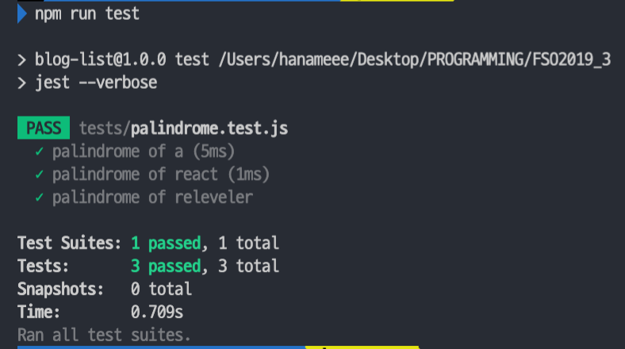
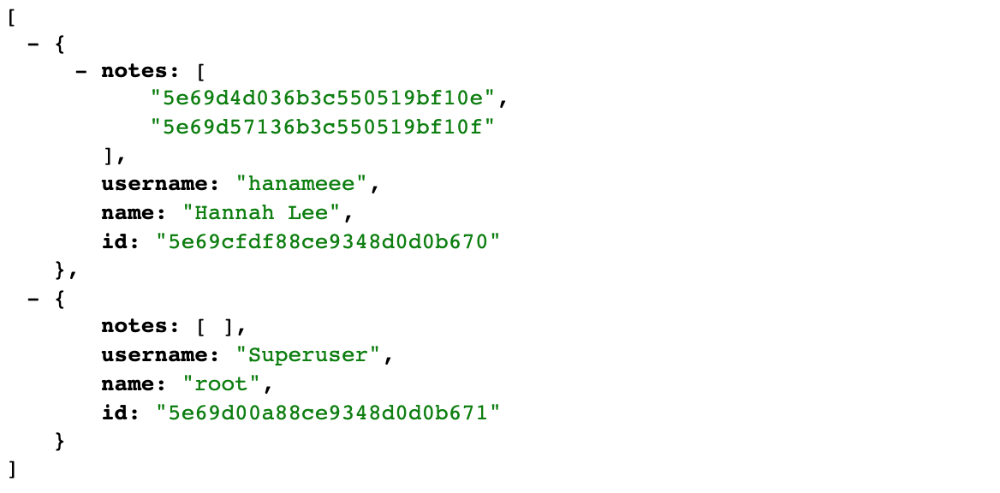
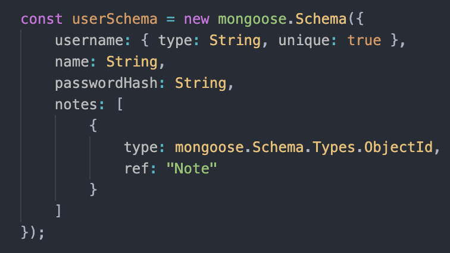
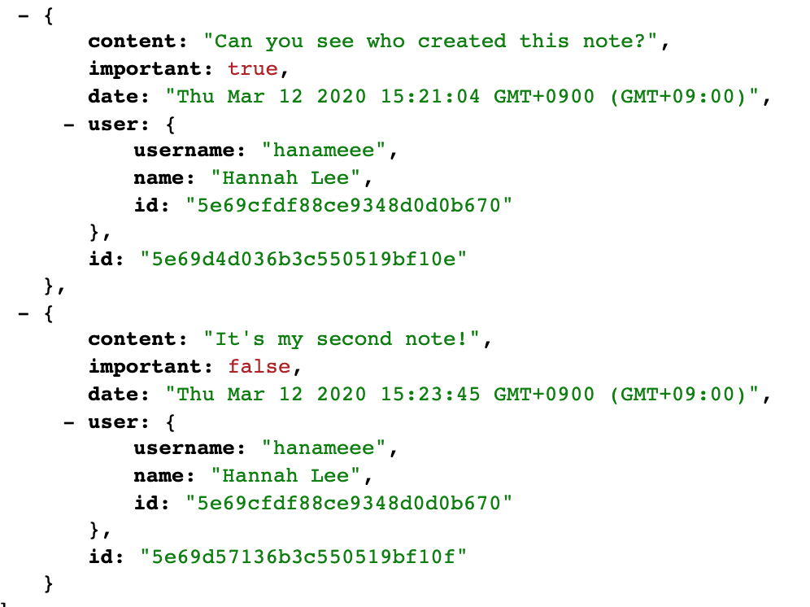

# Part 4 - [Testing Express servers, user administration](https://fullstackopen.com/en/part4)

---

## [a) Structure of backend application, introduction to testing](https://fullstackopen.com/en/part4/structure_of_backend_application_introduction_to_testing)

### 🚧 Project structure

백엔드를 더 진행하기 전, Node.js의 폴더 구조를 정돈해보자.

`Node.js Best Practice Project Structure`


#### index.js

Application을 start 하는 데에 쓰이는 파일로, 아래와 같이 간단하게 작성한다.

```js
const app = require('./app') // 실제 express App을 import 해온 뒤 어플을 시작한다.
const http = require('http')
const config = require('./utils/config')
const server = http.createServer(app)

server.listen(config.PORT, () => {
  console.log(`Server running on port ${config.PORT}`)
})
```


### app.js

```js
const config = require('./utils/config')
const express = require('express')
const bodyParser = require('body-parser')
const app = express()
const cors = require('cors')
const notesRouter = require('./controllers/notes')
const middleware = require('./utils/middleware')
const mongoose = require('mongoose')

console.log('connecting to', config.MONGODB_URI)

mongoose.connect(config.MONGODB_URI, { useNewUrlParser: true })
  .then(() => {
    console.log('connected to MongoDB')
  })
  .catch((error) => {
    console.log('error connection to MongoDB:', error.message)
  })

app.use(cors())
app.use(express.static('build'))
app.use(bodyParser.json())
app.use(middleware.requestLogger)

app.use('/api/notes', notesRouter)

app.use(middleware.unknownEndpoint)
app.use(middleware.errorHandler)

module.exports = app
```


#### /controllers/note.js

event handlers of routes 는 주로 controllers 라고 명명되므로 별개의 controllers 폴더에 저장한다.

```js
const notesRouter = require('express').Router() // 새로운 Router 객체 생성

//...

module.exports = notesRouter // Router 객체 export
```

Router 객체는 무엇일까? Express 매뉴얼에 따른 Router 객체의 정의는 아래와 같다.

>*A router object is an isolated instance of middleware and routes. You can think of it as a “mini-application,” capable only of performing middleware and routing functions. Every Express application has a built-in app router.*

Router은 middleware이다.
특정 모듈 안에서의 "상대적 경로" 를 정의하기 위해 사용될 수 있다.

일례로 기존에 index.js에서 아래와 같이 경로를 정의했다면

```js
app.delete('/api/notes/:id', (request, response) => {
```

note.js 컨트롤러에서는 notesRouter을 import 해와서 아래와 같이 사용하고

```js
notesRouter.delete('/:id', (request, response) => {
```

note controller을 가져오는 app.js 에서는 아래와 같이 작성해준다.

```js
const notesRouter = require('./controllers/notes')
app.use('/api/notes', notesRouter) // notesRouter은 api/notes 하위의 상대경로에서 작동하는 모든 경로들을 정의해 줄 수 있는 것
```


#### utils/config.js

dotenv 라이브러리를 통해 환경변수를 관리한다.

```js
require('dotenv').config()

let PORT = process.env.PORT
let MONGODB_URI = process.env.MONGODB_URI

module.exports = {
  MONGODB_URI,
  PORT
}
```

어플의 다른 파트에서 환경변수가 필요할 때는 아래와 같이 config 모듈을 import 하여 사용한다.

```js
const config = require('./utils/config')

console.log(`Server running on port ${config.PORT}`)
```


#### utils/middleware.js

Logger, errorHandler 등의 middleware도 한 곳에서 작성한 뒤 export 해서 사용한다.

```js
const requestLogger = (request, response, next) => {
  console.log('Method:', request.method)
  console.log('Path:  ', request.path)
  console.log('Body:  ', request.body)
  console.log('---')
  next()
}

const unknownEndpoint = (request, response) => {
  response.status(404).send({ error: 'unknown endpoint' })
}

const errorHandler = (error, request, response, next) => {
  console.error(error.message)

  if (error.name === 'CastError' && error.kind === 'ObjectId') {
    return response.status(400).send({ error: 'malformatted id' })
  } else if (error.name === 'ValidationError') {
    return response.status(400).json({ error: error.message })
  }

  next(error)
}

module.exports = {
  requestLogger,
  unknownEndpoint,
  errorHandler
}
```


### /models/note.js

기존에 mongoose와의 연결을 담당하던 부분을 app.js가 담당하게 되면서 models 폴더 안의 note.js는 오직 notes를 위한 noteSchema 만을 정의한다.

```js
const mongoose = require('mongoose')

const noteSchema = new mongoose.Schema({
  content: {
    type: String,
    required: true,
    minlength: 5
  },
  date: Date,
  important: Boolean,
})

noteSchema.set('toJSON', {
  transform: (document, returnedObject) => {
    returnedObject.id = returnedObject._id.toString()
    delete returnedObject._id
    delete returnedObject.__v
  }
})

module.exports = mongoose.model('Note', noteSchema)
```

---

## b) [Testing the backend](https://fullstackopen.com/en/part4/testing_the_backend)

### 🧪 Testing Node applications

Automated Testing 에 대해 알아보자.

#### 1. Jest 를 사용한 unit testing

`npm install --save-dev jest`
dev 단계에서만 쓰일 것이므로 --save-dev flag를 붙여준다.

`package.json` 

```js
{
  "scripts": {
    ...
    "test": "jest --verbose"  // test 명령어로 Jest 를 사용한 test 를 실행하고, verbose style 로 execution 결과를 report 할 것
  },
 ...
  "jest": {
   "testEnvironment": "node" // Jest의 최신 버전에선 testEnvironment를 명시할 것을 요구
 }
}
```

`tests/palindrome.test.js `

```js
// 테스트 할 Function을 import 해온 뒤 변수에 할당
const palindrome = require('../utils/for_testing').palindrome

// 개별 test cases 는 test function 안에 정의됨 
// 첫번째 파라미터는 test description (string)
// 두번째 파라미터는 test case의 functionality 를 정의하는 함수
test('palindrome of a', () => {
  const result = palindrome('a')

  expect(result).toBe('a')
})

test('palindrome of react', () => {
  const result = palindrome('react')

  expect(result).toBe('tcaer')
})

test('palindrome of releveler', () => {
  const result = palindrome('releveler')

  expect(result).toBe('releveler')
})
```

Test case 의 Functionality 를 정의하는 함수를 조금 더 자세히 보면 다음과 같다.

```js
() => {
  // test 될 코드를 실행해 result 변수에 저장한다
  const result = palindrome('react')
  // expect 함수를 이용해 result 를 verify 한다
  // expect 함수는 다양한 matcher 함수들을 제공하는데, 우리는 두 string을 비교하므로 toBe 를 사용한 것
  expect(result).toBe('tcaer')
}
```

Test 를 돌려보면 아래와 같은 결과가 나옴을 알 수 있다.




+) Test cases 들을 describe block 으로 감쌀 수도 있는데, 이런 Describe blocks 들은 test 들을 logical collections 로 그룹핑 할 때 쓰인다.

```js
const average = require("../utils/for_testing").average;

describe("average", () => {
    test("of one value is the value itself", () => {
      	// result 라는 변수에 따로 할당하지 않고 바로 코드 식을 expect 안에 넣을 수도 있다.
        expect(average([1])).toBe(1);
    });

    test("of many is calculated right", () => {
        expect(average([1, 2, 3, 4, 5, 6])).toBe(3.5);
    });

    test("of empty array is zero", () => {
        expect(average([])).toBe(0);
    });
});
```


### ⏰ async / await

async/await 문법은 함수는 promise를 리턴하는 비동기적 함수를 마치 동기적 함수를 작성할 때와 유사하게 작성하게 해준다.

기존 DB에서 notes 를 fetch 해오는, promise 를 리턴하는 함수는 아래와 같이 생겼었다.

```js
Note.find({})
  .then(notes => {
  	console.log('opreration returned the following notes', notes)
})
	.then(response => {
  	console.log("the first note is removed")
})
// promise chaining을 통해 callback hell 탈출 가능
```

이런 promise chaining은 기존 비동기함수를 처리하던 방법인 콜백함수보다는 나은 방법이지만, 더 나은 방법이 있다!

ES6 에서 소개된 [generator functions](https://developer.mozilla.org/en-US/docs/Web/JavaScript/Reference/Global_Objects/Generator) 은 잘 쓰이지 않고, 대신 ES7에서 소개된 async/await 키워드가 generator과 같은 기능을 제공하며 훨씬 더 문법적으로 이해하기 쉽다.

```js
// 기존 .then chaining을 사용한 방법
Note.find({}).then(notes => {console.log('opreration returned the following notes', notes)})

// async/await 키워드를 사용한 방법
const notes = await Note.find({})
console.log('opreration returned the following notes', notes)
```

두번째 async/await 을 사용한 방법은 완벽하게 synchronous code 처럼 보인다!
코드 실행이 `const notes = await Note.find({})` 에서 멈추고, promise가 furfilled 될 때 까지 기다린다. promise가 furfilled 되면 그제서야 다음 코드가 실행된다.

다만, await 키워드는 아무데에서나 쓰일 수 있는게 아니다! 반드시 async 함수 안에서만 사용될 수 있다.

```js
// async 키워드를 통해 main 함수가 비동기적으로 작동한다는 것을 선언한다
const main = async () => {
  const notes = await Note.find({})
  console.log('opreration returned the following notes', notes)
  const response = await notes[0].remove()
  console.log('the first note is removed')
}
main()
```

##### async/await 에서의 error handling

try-catch 를 이용한다.

```js
notesRouter.post('/', async (request, response, next) => {
  const body = request.body

  const note = new Note({
    content: body.content,
    important: body.important === undefined ? false : body.important,
    date: new Date(),
  })
  // error handling
  try { 
    const savedNote = await note.save()
    response.json(savedNote.toJSON())
  } catch(exception) {
    // next 함수를 호출해 exception을 error handling middleware로 보낸다!
    next(exception)
  }
})
```

---

## [c) User administration](https://fullstackopen.com/en/part4/user_administration)

user 과 note 는 1:n 관계이다.

위와 같은 관계에 대해 모델링 방법이 정형화된  (note를 작성한 user의 id가 notes table에 foreign key 로 저장됨) Relational database 와는 달리, Mongo DB와 같은 Document database (schema-less) 는 이런 1:n 관계를 모델링하는 방법이 다양하다.

Mongo DB 역시 다른 collection에서 reference 하기 위해 object의 id를 사용할 수 있다. ( foreign key 와 유사. )
Mongo DB 는 ver 3.2 부터 join query 와 유사한 [lookup aggregation queries](https://docs.mongodb.com/manual/reference/operator/aggregation/lookup/) 가 생기긴 했지만, 이 역시 내부적으로는 multiple queries 를 날려 처리하기에 우리는 multiple queries 로 해결할 것임.

### Mongoose schema for users

user 과 note 의 1:n 관계를 모델링하는 방법은 다양하지만, 우리는 user document 안에 해당 user 이 작성한 note ids 를 저장하는 방법을 택할 것.

`models/user.js`

```js
const mongoose = require('mongoose')

const userSchema = new mongoose.Schema({
  username: String,
  name: String,
  passwordHash: String,
  // 아래 부분이 user document에 저장된 ids of notes 부분. Array of Mongo ids의 형태
  notes: [
    {
      type: mongoose.Schema.Types.ObjectId,
      ref: 'Note'
    }
  ],
})

userSchema.set('toJSON', {
  transform: (document, returnedObject) => {
    returnedObject.id = returnedObject._id.toString()
    delete returnedObject._id
    delete returnedObject.__v
    // the passwordHash should not be revealed
    delete returnedObject.passwordHash
  }
})

const User = mongoose.model('User', userSchema)

module.exports = User
```

noteSchema 도 수정해주기

`model/note.js`

```js
const noteSchema = new mongoose.Schema({
  content: {
    type: String,
    required: true,
    minlength: 5
  },
  date: Date,
  important: Boolean,
  user: {
    type: mongoose.Schema.Types.ObjectId,
    ref: 'User'
  }
})
```

이제 references 가 2개의 document에 각각 저장되었다. Note는 해당 note 를 작성한 user의 reference를, user은 자신이 작성한 notes 들의 reference array 를!

### Creating Users

User은 unique 한 username, name, 그리고 passwordHash 값을 가지고 있다. passwordHash 값은 유저의 비밀번호에 [one-way hash function](https://en.wikipedia.org/wiki/Cryptographic_hash_function) 이 적용된 결과값으로, 항상 이렇게 암호화된 hash 값을 DB에 저장해야 한다. 

#### controller에 usersRoute handler 추가하기

우리는 password hash 를 generate 하기 위해 bcrypt 패키지를 사용할 것.

새로운 user 을 만드는 과정은 users 경로로 HTTP POST request 를 날리는 방식으로 이루어진다. 따라서 해당 과정을 담당할 별도의 router 을 정의해줘야 한다.

`app.js` 

```js
const usersRouter = require('./controllers/users')
// ...
app.use("/api/users", usersRouter)
```

`controllers/users`

```js
const bcrypt = require("bcrypt");
const usersRouter = require("express").Router();

const User = require("../models/user");

// 현재 존재하는 모든 user 가져오기
usersRouter.get("/", async (request, response, next) => {
    const users = await User.find({});
    response.json(users.map(u => u.toJSON()));
});

// 새로운 user 만들기
usersRouter.post("/", async (request, response, next) => {
    try {
        const body = request.body;

        const saltRounds = 10;
        const passwordHash = await bcrypt.hash(body.password, saltRounds);

        const user = new User({
            username: body.username,
            name: body.name,
            passwordHash
        });

        const savedUser = await user.save();
        response.json(savedUser);
    } catch (exception) {
        next(exception);
    }
});

module.exports = usersRouter;
```

#### Test 추가하기

`tests/test_helper.js`

```js
// ...
const usersInDb = async () => {
    const users = await User.find({});
    return users.map(user => user.toJSON());
};

module.exports = {
    initialNotes,
    nonExistingId,
    notesInDb,
    usersInDb
};
```

`tests/notes_api.test.js`

```js
// ...
const User = require("../models/user");
// ...
describe("when there is initially one user at db", () => {
    beforeEach(async () => {
        await User.deleteMany({});
        const user = new User({ username: "root", password: "secret" });
        await user.save();
    });

    test("creation succeeds with a fresh username", async () => {
        const usersAtStart = await helper.usersInDb();

        const newUser = {
            username: "hanameee",
            name: "hannah",
            password: "goskgosk"
        };

        await api
            .post("/api/users")
            .send(newUser)
            .expect(200)
            .expect("Content-Type", /application\/json/);

        const usersAtEnd = await helper.usersInDb();
        expect(usersAtEnd.length).toBe(usersAtStart.length + 1);

        const usernames = usersAtEnd.map(u => u.username);
        expect(usernames).toContain(newUser.username);
    });
  
    // 현재 중복 username 방지 기능은 구현하지 않았으므로 이 테스트는 fail 할 것 - TDD
    test("creation fails with a duplicate username", async () => {
        const usersAtStart = await helper.usersInDb();

        const newUserWithDuplicateName = {
            username: "root",
            name: "groot",
            password: "secret"
        };

        const result = api
            .post("/api/users")
            .send(newUserWithDuplicateName)
            .expect(400)
            .expect("Content-Type", /application\/json/);

        expect(result.body.error).toContain("`username` to be unique");

        const usersAtEnd = await helper.usersInDb();
        expect(usersAtEnd.length).toBe(usersAtStart.length);
    });
});
```

#### schema 에 중복 username 방지 플러그인 추가하기

`npm install --save mongoose-unique-validator`

`models/user.js`

```js
const mongoose = require('mongoose')
const uniqueValidator = require('mongoose-unique-validator')

const userSchema = new mongoose.Schema({
  username: {
    // 이렇게 변경
    type: String,
    unique: true
  },
  name: String,
// ...
userSchema.plugin(uniqueValidator)
// ...
```

이런 중복 방지 기능 외에도 최소 길이 제한, 허용되는 문자 제한 등 다양한 기능을 추가할 수 있다.

### Creating Users 수정

새로운 note 를 만들 때, 해당 note 가 그 노트를 생성한 유저에게 할당되도록 수정되어야 함.
Note에 post request를 보낼 때, request body의 user field 에 userId가 같이 날라가게 수정하기.

`controllers/notes.js`

```js
const User = require("../models/user");
// ...
notesRouter.post("/", async (request, response, next) => {
    const body = request.body;
  	// request body에서 같이 날라온 userId를 바탕으로 해당 user document 찾기
    const user = await User.findById(body.userId);
  
    const note = new Note({
        content: body.content,
        important: body.important || false,
        date: new Date(),
      	// Note document 에는 user field 로 userId 값이 저장됨
        user: user._id
    });
    try {
      	const savedNote = await note.save();
      	// 새로운 note document를 save 한 후, user document 의 notes field도 업데이트 해주기
        user.notes = user.notes.concat(savedNote._id);
      	// 새로운 user document도 저장!
        await user.save();
```

새로운 note document 가 추가될 때, 상응하는 user document 의 notes field 도 함께 업데이트 된다는 것에 주의할 것.

### Mongoose의 Populate 메서드를 통해 join 구현하기

우리는 /api/users 에 HTTP GET 요청을 보낼 때, user object 가 단지 note id 뿐만 아니라 note content 까지 다 보여주길  원한다.

Relational database (RDB) 에선 이 기능이 join query 를 통해 가능하지만, Mongo Db와 같은 document database 에선 이런 collections 간의 join query를 제대로 지원하지 않는다.

대신, Mongoose 라이브러리의 **populate** 메서드를 통해 multiple query 를 날려 join 을 구현할 수 있다. 
(단 RDB의 join은 transactional 한 것에 반해, multiple query 를 통한 join은 joined 되는 collection 들의 consistent 한 상태를 보장하지 않는다. State of the collections 들이 query 도중 변경될 수 있다는 것.)

`controllers/users`

```js
usersRouter.get("/", async (request, response, next) => {
    const users = await User.find({}).populate("notes");
    response.json(users.map(u => u.toJSON()));
});
```

populate method 는 find method 로 initial query 를 날린 이후에 chained 된다.

populate method의 파라미터로 전달된 `notes` 는 뭘 뜻할까?
현재 /api/users 로 GET 요청을 보내 얻어진 데이터는 다음과 같이 생겼다.



우리가 notesRouter 을 정의할 때, user object에 note의 id만 저장하게 했기 때문에!

그런데 `User.find({}).populate("notes")` query  를 통해, user collection 의 notes field는 해당 field가 reference 하고 있었던 note document 로 대체되게 된다.

`model/user.js`



Populate method 를 통해 note object 에서 우리가 원하는 field 만 가져올 수도 있다. (Mongo [syntax](https://docs.mongodb.com/manual/tutorial/project-fields-from-query-results/#return-the-specified-fields-and-the-id-field-only) 참고)

 `controllers/users`

```js
usersRouter.get("/", async (request, response, next) => {
  	// populate의 2번째 파라미터로 우리가 원하는 field 만 전달
    const users = await User.find({}).populate("notes", {
        content: 1,
        date: 1
    });
    response.json(users.map(u => u.toJSON()));
});
```

마찬가지 방법으로 Notes 를 GET 해올 때도 user의 Information을 가져오게끔 한다.

`controllers/notes`

```js
notesRouter.get("/", async (request, response) => {
    const notes = await Note.find({}).populate("user", {
        username: 1,
        name: 1
    });
    response.json(notes.map(note => note.toJSON()));
});
```
이제 아래와 같이 우리가 원하는 user object 의 field 만이 (username, name)이 Note object의 user field에 딸려오는 것을 볼 수 있다.



⚠️ 주의할 점: Mongo DB는 notes 의 user field 에 저장된 id 들이 user collection의 document 들을 reference 하고 있다는 것을 모른다!

이 polulate method 가 가능했던 것은, 어디까지나 우리가 Mongoose schema 에서 user field의 type과 ref 를 아래와 같이 정의해줬기 때문이라는 것을 꼭 이해할 것.

```js
const noteSchema = new mongoose.Schema({
  content: {
    type: String,
    required: true,
    minlength: 5
  },
  date: Date,
  important: Boolean,
  user: {
    type: mongoose.Schema.Types.ObjectId,
    ref: 'User'
  }
})
```


## [d) Token authentication](https://fullstackopen.com/en/part4/token_authentication)

 유저는 우리 application에 로그인이 가능해야 하고, 유저가 로그인 된 상태에서 note 를 만들 경우 해당 user information 이 자동으로 note에 포함되어야 한다.

우리는 이 로그인 기능을 [token based authentication](https://scotch.io/tutorials/the-ins-and-outs-of-token-based-authentication#toc-how-token-based-works) 을 통해 우리 백엔드에 구현할 것임!

Token based authentication 은 아래와 같이 동작한다.


우리는 jsonwebtoken 라이브러리를 통해서 [JSON web tokens](https://jwt.io/) 을 생성할 것임.

```bash
npm install jsonwebtoken --save
```

`npm install jsonwebtoken --save `

### loginRouter handler 만들기
`controllers/login`

```js
const jwt = require("jsonwebtoken");
const bcrypt = require("bcrypt");
const loginRouter = require("express").Router();
const User = require("../models/user");

loginRouter.post("/", async (request, response) => {
    const body = request.body;
  	// 1. body의 username과 일치하는 User 객체가 DB에 있는지 찾기
    const user = await User.findOne({ username: body.username });
  	// 2. user 객체가 있다면 해당 user 객체의 passwordHash 값이 body의 password (가 암호화된 hash) 와 같은지 bcrypt.compare 을 통해 확인하기
    const passwordCorrect =
        user === null
            ? false
            : await bcrypt.compare(body.password, user.passwordHash);
  
  	// 3. 찾아진 user 객체가 없거나 (invalid username) passwordCorrect가 false라면 (invalid password) 401 코드와 error message를 반환하기
    if (!(user && passwordCorrect)) {
        // code 401 unauthorized
        return response.status(401).json({
            error: "invalid username or password"
        });
    }
  
  	// 4. token의 기반이 될 payload object
    const userForToken = {
        username: user.username,
        id: user._id
    };
  
  	// 5. jwt를 sign 하기 - .env 파일에 있는 SECRET 환경변수를 알고 있어야만 유효한 token을 생성할 수 있음
    const token = jwt.sign(userForToken, process.env.SECRET);
  
  	// 6. 요청이 성공하면 200 OK 응답과 함께 생성된 token과 username, user 정보다 response body에 함께 날아간다
    response
        .status(200)
        .send({ token, username: user.username, name: user.name });
});

module.exports = loginRouter;
```

`app.js`

app.js 에 loginRouter 등록해주기

```js
const loginRouter = require('./controllers/login')

//...

app.use('/api/login', loginRouter)
```

### 로그인 된 유저만 note 를 생성할 수 있도록 제한하기

post request 가 유효한 token 을 가지고 있어야만 notes 를 생성할 수 있도록 변경해야 함.
그리고 token 으로 식별된 user 객체의 notes field 배열에 저장되게!브라우저에서 서버로 token 을 전송하는 방법은 다양하지만, 우리는 [Authorization](https://developer.mozilla.org/en-US/docs/Web/HTTP/Headers/Authorization) header 을 활용할 것임. 만약 서버가 authenticate 하기 위해 다양한 방법을 사용한다면, header 은 어떤 [authentication schema](https://developer.mozilla.org/en-US/docs/Web/HTTP/Authentication#Authentication_schemes) 가 사용되었는지도 알려줘야 한다. 우리는 Bearer schema 를 사용할 것이고, token 앞에 prefix 로 붙이는 방식으로 구현할 것.

`controllers/notes` 

```js
const jwt = require("jsonwebtoken");

// ...
// getTokenFrom 함수는 authorization 헤더에서 token만을 빼서 리턴한다
const getTokenFrom = request => {
    const authorization = request.get("authorization");
    if (authorization && authorization.toLowerCase().startsWith("bearer ")) {
        return authorization.substring(7);
    }
    return null;
};

notesRouter.post("/", async (request, response, next) => {
    const body = request.body;
    const token = getTokenFrom(request);

    try {
      	// decodedToken은 jwt.verify를 통해 토큰의 유효성을 체크하고 decode 한다 ( = token 생성시 payload로 넘겨준 object 를 리턴한다)
        const decodedToken = jwt.verify(token, process.env.SECRET);
      	// token이 없거나 decoded 된 token이 user id를 포함하고 있지 않으면 401 unauthorized 리턴
        if (!token || !decodedToken.id) {
            response.status(401).json({ error: "token missing or invalid" });
        }

        const user = await User.findById(body.userId);
        const note = new Note({
            content: body.content,
            important: body.important || false,
            date: new Date(),
            user: user._id
        });
        const savedNote = await note.save();
        user.notes = user.notes.concat(savedNote._id);
        await user.save();
        response.json(savedNote.toJSON());
    } catch (exception) {
        next(exception);
    }
});

// ...
```

